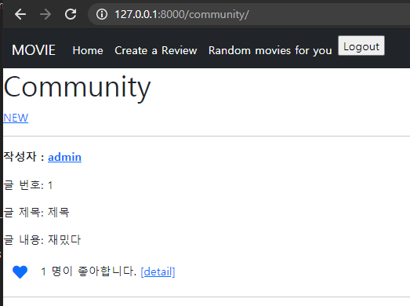
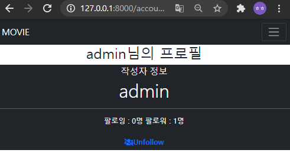
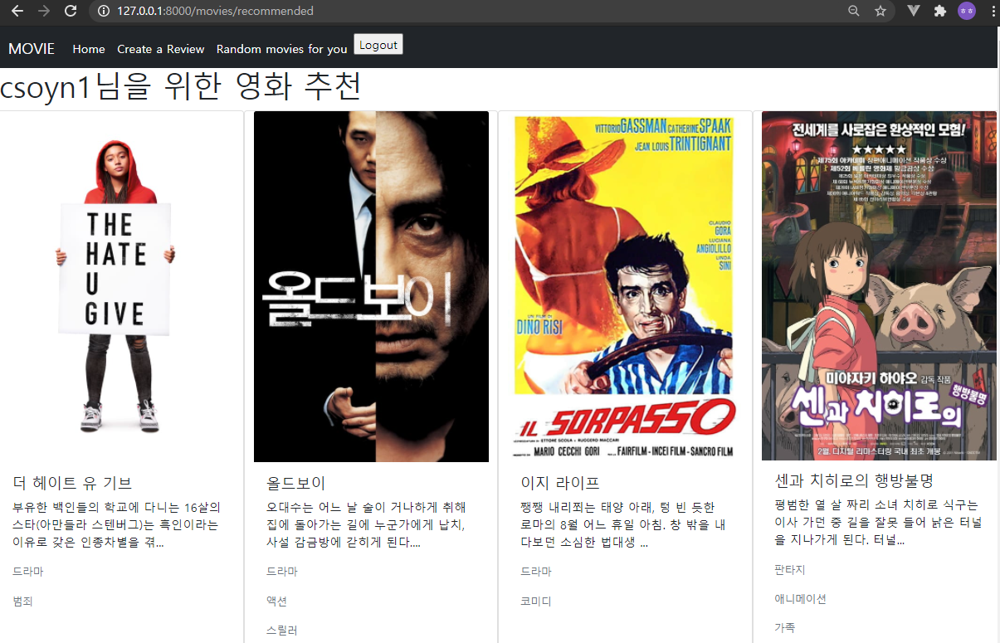
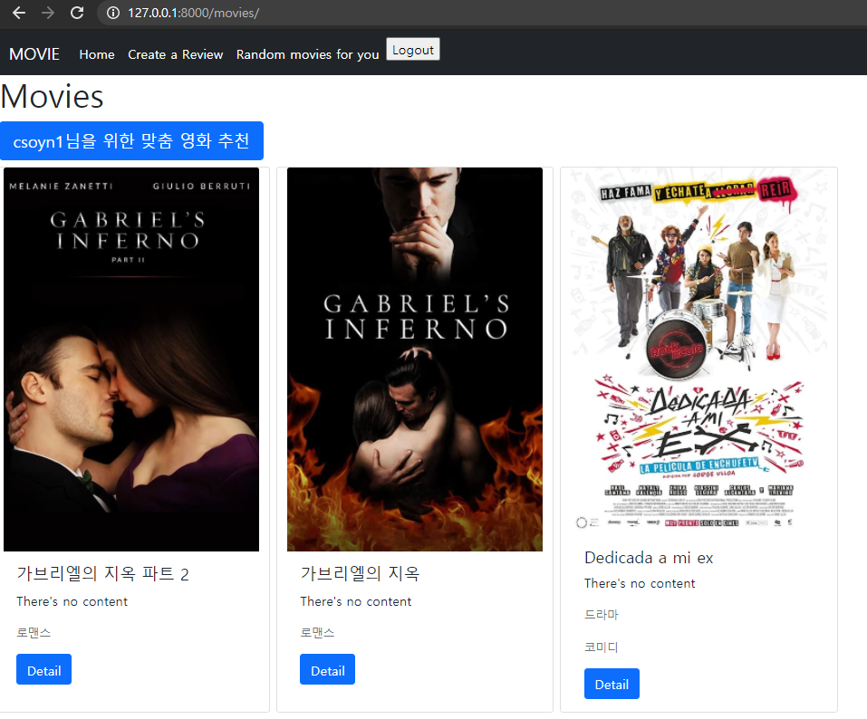

# PJT09

> 알고리즘을 적용한 서버 구성

- AJAX통신과JSON구조에대한이해
- Database 1:N, M:N 관계의이해와데이터관계설정
- 추천 알고리즘 작성


### 느낀점

오늘 프로젝트는 기존 django로 구현한 좋아요와 팔로우 기능을 `JavaScripts`로 다시 구현해보고, 추천 영화를 보여주는 것을 구현하는 것 이었다.

월요일, 화요일에 한 번 해봤던 내용이었는데도, 아직 `javascripts` 가 익숙하지 않아 어려웠다..

`scripts` 부분과 보여지는 `body` 부분을 왔다갔다 하는 것, 필요한 정보를 정의하는 부분이 어려웠다..오늘 프로젝트가 아니었다면, 이런 부분을 다시 한 번 제대로 복습하지 못했을 것 같다. `(axios)`

오늘 프로젝트가 조금 길었는데, 페어가 너무 고생해준 거 같아 미안하고 고마운 마음입니당ㅎㅎㅎ


### - LIKE

**community/views.py**

```python
@require_POST
def like(request, review_pk):
    if request.user.is_authenticated:
        review = get_object_or_404(Review, pk=review_pk)
        user = request.user
        # 좋아요 취소
        if review.like_users.filter(pk=user.pk).exists():
            review.like_users.remove(user)
            liked = False
        else:
            review.like_users.add(user)
            liked = True
        like_status = {
            'liked': liked,
            'count': review.like_users.count()
        }
        return JsonResponse(like_status)
    # return HttpResponse(status=401)
```

**scripts**

```python
<script>
    const forms = document.querySelectorAll('.like-form')
    const csrftoken = document.querySelector('[name=csrfmiddlewaretoken]').value
    forms.forEach(form => {
      form.addEventListener('submit', function (event) {
        // submit event 전파 중단 
        event.preventDefault()
        // 요청 : 좋아요 => 좋아요 취소 or 좋아요 취소 => 좋아요
        // article_pk 필요해! => HTML data attributes (https://developer.mozilla.org/ko/docs/Learn/HTML/Howto/Use_data_attributes)
        const reviewId = event.target.dataset.reviewId
      
        axios({
          method: 'post',
          url : `http://127.0.0.1:8000/community/${reviewId}/like/`,
          // url: `${reviewId}/like/`,
          headers: {
            'X-CSRFToken': csrftoken
          }
        })
          .then(response => {
            console.log(response)
            const liked = response.data.liked
            const likeIcon = document.querySelector(`.like-${reviewId}`)
            if (liked) {
              likeIcon.classList.remove('far')
              likeIcon.classList.add('fas')
            }
            else {
              likeIcon.classList.remove('fas')
              likeIcon.classList.add('far')
            }
            const count = response.data.count
            const countSpan = document.querySelector(`.like-count-${reviewId}`)
            countSpan.innerText = `${count} 명이 좋아합니다.`

          })
      })
    })
  </script>
```

*******


### - FOLLOW

**accounts/views.py**

```python
@require_POST
def follow(request, user_pk):
    if request.user.is_authenticated:
        person = get_object_or_404(get_user_model(), pk=user_pk)
        user = request.user
        if person != user:
            if person.followers.filter(pk=user.pk).exists():
                person.followers.remove(user)
                followed = False
            else:
                person.followers.add(user)
                followed = True
            follow_status = {
                'followed' : followed,
                'followers_count' : person.followers.count(),
                'followings_count' : person.followings.count(),
            }
            return JsonResponse(follow_status)
    return HttpResponse(status=401)
```

**script**

```html
<script>
    const form = document.querySelector('#follow-form')
    const csrftoken = document.querySelector('[name=csrfmiddlewaretoken]').value
    form.addEventListener('submit', function (event) {
      event.preventDefault()
      const userId = event.target.dataset.userId
      console.log(userId)

      axios({
        method: 'post',
        baseURL: 'http://127.0.0.1:8000/accounts/',
        url: `follow/${userId}/`,
        headers: {
          'X-CSRFToken': csrftoken
        }
      })
        .then(response => {
          const followed = response.data.followed
          const followButton = document.querySelector(`.follow-${userId}`)
          if (followed) {
            followButton.classList.toggle('fa-user-friends')
            followButton.classList.toggle('fa-users-slash')
            followButton.innerText = 'Unfollow'
          }
          else {
            followButton.classList.toggle('fa-users-slash')
            followButton.classList.toggle('fa-user-friends')
            followButton.innerText = 'Follow'
          }
          console.log(response.data.followers_count)
          console.log(response.data.followings_count)
          const followersCount = response.data.followers_count
          const followingsCount = response.data.followings_count
          const friendsP = document.querySelector('.friends')
          friendsP.innerText = `팔로잉 : ${followingsCount}명  팔로워 : ${followersCount}명`
        })
    })
```

****

### 결과화면







